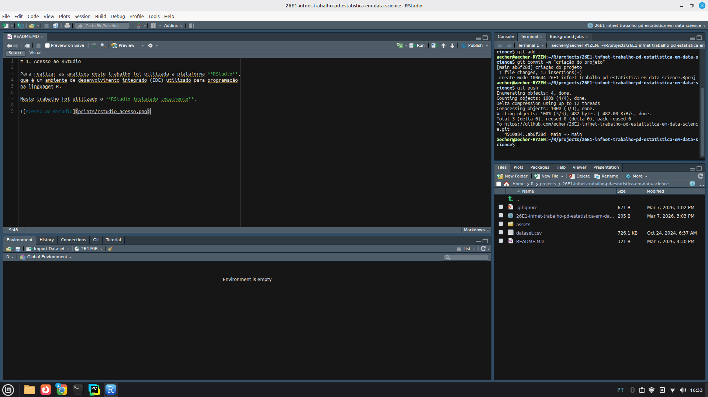
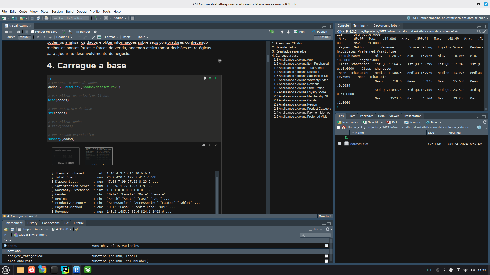
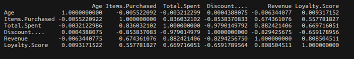

Github: <https://github.com/echer/26E1-infnet-trabalho-pd-estatistica-em-data-science.git>

RPUBS: <https://rpubs.com/alanecher/infnet-data-science-em-ia-trabalho-estatistica-em-data-science>

# Mostre através de prints que você tem acesso a uma plataforma RStudio (instalado localmente ou nuvem).

Para realizar as análises deste trabalho foi utilizada a plataforma **RStudio**, que é um ambiente de desenvolvimento integrado (IDE) utilizado para programação na linguagem R.

Neste trabalho foi utilizado o **RStudio instalado localmente**.



# Escolha uma base de dados para realizar esse projeto. Essa base de dados será utilizada durante toda sua análise. Essa base necessita ter 4 (ou mais) variáveis de interesse. Caso você tenha dificuldade para escolher uma base, o professor da disciplina irá designar para você.

A base de dados foi obtida através da planilha disponibilizada pela professora com o link para o kaggle (<https://www.kaggle.com/datasets/rajagrawal7089/electronic-store-dataset>) e contém dados gerados relacionados ao comportamento de consumidores em compras para uma loja de eletronicos, a base possui 5000 linhas e 15 colunas com uma mistura de dados numéricos e categóricos.

# Explique qual o motivo para a escolha dessa base e explique os resultados esperados através da análise.

A base foi escolhida pois possui dados de vendas de uma loja de eletronicos, assim podemos analisar os dados e obter informações sobre seus compradores conhecendo melhor os pontos fortes e fracos de venda, podendo assim tomar decisões estratégicas para ajudar no desenvolvimento do negócio.

# Carregue a base para o RStudio e comprove o carregamento tirando um print da tela com a base escolhida presente na área "Ambiente"/Enviroment. Detalhe como você realizou o carregamento dos dados.

A base foi carregada através do arquivo csv da pasta dados utilizando a função read.csv conforme a print abaixo:



```{r}
# Carregar a base de dados
dados <- read.csv("dados/dataset.csv")

library(dplyr)
glimpse(dados)
```

```{r}
any(is.na(dados))
```

# Instale e carregue os pacotes de R necessários para sua análise (mostre o código necessário):

Aqui realizei o carregamento dos pacotes R necessário para a análise.

```{r}
library(ggplot2)
library(tidyverse)
library(summarytools)
```

# Escolha outros pacotes necessários, aponte sua necessidade e instale e carregue (mostrando o código necessário).

```{r}
library(gtsummary)
library(gt)
library(corrplot)
```

# Aplique uma função em R que seja útil para sua análise e mostre.

```{r}
dados |>
  tbl_summary()
```

Foram utilizados as seguintes funções:

1.  min() - Utilizado para encontrar o valor mínimo da coluna

    ```{r}
    min(dados$Age, na.rm = TRUE)
    ```

2.  quantile() - Utilizado para encontrar os quartis passando por parametro decimal

    ```{r}
    quantile(dados$Age, 0.25, na.rm = TRUE)
    ```

3.  IQR() - Utilizado para calcular o IQR valor que representa a diferença entre Q3 e Q1

    ```{r}
    cat("IQR:",IQR(dados$Age, na.rm = TRUE),"\n")
    ```

4.  mean() - Utilizado para encontrar a média da coluna

    ```{r}
    cat("Média:",mean(dados$Age, na.rm = TRUE),"\n")
    ```

5.  sd() - Utilizado para encontrar o desvio padrão da coluna

    ```{r}
    cat("Desvio padrão:",sd(dados$Age, na.rm = TRUE),"\n")
    ```

6.  ggplot() - Utilizado para imprimir os dados em gráficos

7.  as.factor() - Utilizado para converter os dados numéricos em categóricos

    ```{r}
    dados$Membership.Status <- as.factor(dados$Membership.Status)
    dados$Warranty.Extension <- as.factor(dados$Warranty.Extension)
    ```

8.  round() - Utilizado para arredondar os dados numéricos antes de converter para categóricos

    ```{r}
    dados$Store.Rating <- as.factor(round(dados$Store.Rating))
    dados$Satisfaction.Score <- as.factor(round(dados$Satisfaction.Score))
    ```

9.  Além das funções das libs acima foi feito também a criação de duas funções para auxiliar na análise de cada coluna

    1.  analyze_categorical: Utilizado para fazer a análise das colunas com valores categóricos, esta função imprime o gráfico de barras com a distribuição e frequencia dos valores da coluna analisada.
    2.  plot_analysis: Utilizado para fazer a análise das colunas com valores numéricos, esta função imprime o gráfico de boxplot e o histograma.

```{r}
analyze_categorical <- function(column, label){
  ggplot(data.frame(column), aes(x=column)) +
    geom_bar(fill="lightblue") +
    labs(
      title=paste("Distribuição de", label),
      x=label,
      y="Frequência"
    ) +
    theme_minimal()
}

plot_analysis <- function(column, columnLabel){

  Q0 <- min(column, na.rm = TRUE)
  Q1 <- as.numeric(quantile(column, 0.25, na.rm = TRUE))
  Q2 <- as.numeric(quantile(column, 0.50, na.rm = TRUE))
  Q3 <- as.numeric(quantile(column, 0.75, na.rm = TRUE))
  Q4 <- as.numeric(quantile(column, 1.00, na.rm = TRUE))

  IQR_val <- IQR(column, na.rm = TRUE)
  
  mean_val <- mean(column, na.rm = TRUE)
  sd_val <- sd(column, na.rm = TRUE)
  
  # binwidth automático (Freedman-Diaconis)
  n <- length(column)
  binwidth <- 2 * IQR_val / (n^(1/3))

  LI <- Q1 - 1.5 * IQR_val
  LS <- Q3 + 1.5 * IQR_val
  
  cat("Média:",mean_val,"\n")
  cat("Mediana:",Q2,"\n")
  cat("Desvio padrão:",sd_val,"\n")
  cat("Q1:",Q1,"\n")
  cat("Q3:",Q3,"\n")
  cat("IQR:",IQR_val,"\n")

  # Boxplot
  box <- ggplot(data.frame(column), aes(x = "", y = column)) +
    geom_boxplot(fill = "lightblue") +
    geom_hline(yintercept = LI, color = "red", linetype = "dashed") +
    geom_hline(yintercept = LS, color = "blue", linetype = "dashed") +
    geom_hline(yintercept = Q0, color = "orange", linetype = "dashed") +
    geom_hline(yintercept = Q4, color = "orange", linetype = "dashed") +

    annotate("text", x = 1.2, y = Q0, label = "(0%)") +
    annotate("text", x = 1.2, y = Q1, label = paste("Q1 =", Q1)) +
    annotate("text", x = 1.2, y = Q2, label = paste("Q2 =", Q2)) +
    annotate("text", x = 1.2, y = Q3, label = paste("Q3 =", Q3)) +
    annotate("text", x = 1.2, y = Q4, label = "(100%)") +

    annotate("text", x = 1.2, y = LI, label = paste("Limite Inf:", round(LI,2))) +
    annotate("text", x = 1.2, y = LS, label = paste("Limite Sup:", round(LS,2))) +

    labs(title = paste("Boxplot -", columnLabel),
         y = columnLabel,
         x = "")

  # Histograma
  hist <- ggplot(data.frame(column), aes(x = column)) +
    geom_histogram(binwidth = binwidth,
                   aes(y=..density..),
                   fill = "lightblue",
                   color = "black") +
    geom_density(color="darkblue", size=1) +
    geom_vline(xintercept=mean_val,
               color="red",
               linetype="dashed") +

    geom_vline(xintercept=Q2,
               color="green",
               linetype="dashed") +
    labs(title = paste("Histograma -", columnLabel),
         x = columnLabel,
         y = "Frequência")
  
  qqplot <- ggplot(dados, aes(sample = column)) +
    stat_qq() +
    stat_qq_line(color = "red") +
    labs(title = paste("QQPlot -", columnLabel))

  print(box)
  print(hist)
  print(qqplot)

}
```

# Escolha uma variável de seu banco de dados e calcule:

```{r}
dados |>
  summarise(
    min = min(Age, na.rm = TRUE),
    q1 = quantile(Age, probs = 0.25, na.rm = TRUE),
    mediana = median(Age, na.rm = TRUE),
    media = mean(Age, na.rm = TRUE),
    q3 = quantile(Age, 0.75, na.rm = TRUE),
    max = max(Age, na.rm = TRUE),
    desvio_padrao = sd(Age, na.rm = TRUE)
  ) |>
  gt()
```

Foi realizado também a analise de todas as metricas acima em todos as colunas numéricas da base de dados no item 11 do trabalho.

# Utilizando o pacote summarytools (função descr), descreva estatisticamente a sua base de dados.

Aqui utilizei o summarytools para descrever os dados estatisticamente, coloquei as principais métricas e filtrei apenas as colunas numéricas

```{r}
descr(dados[sapply(dados, is.numeric)], stats = c("mean","sd","min","q1","med","q3","max"))
```

# Escolha uma variável e crie um histograma. Justifique o número de bins usados. A distribuição dessa variável se aproxima de uma "normal"? Justifique.

A variável escolhida foi “Total Spent”, que representa o valor total gasto por cada cliente. Inicialmente foi gerado um histograma utilizando bins = 1, porém o gráfico ficou difícil de interpretar, pois os valores da variável variam até valores superiores a 600. Dessa forma, foi utilizado bins = 10, dividindo os dados em dez classes, o que permite visualizar melhor a distribuição dos valores e a concentração de observações em diferentes faixas de gasto.

Observando o histograma, nota-se que a distribuição não apresenta um formato aproximadamente simétrico, característico de uma distribuição normal. A distribuição apresenta assimetria à direita, com uma cauda mais longa para valores mais altos de gasto. Isso indica que a maior parte dos clientes apresenta valores de gasto menores ou intermediários, enquanto apenas uma pequena parcela apresenta valores de gasto elevados.

O histograma também foi aplicado para todas as colunas numéricas da base de dados no item 11.

```{r}
column = dados$Total.Spent
columnLabel = "Total Gasto"
bins = 10
mean_val = mean(column, na.rm = TRUE)
Q2 = quantile(column, 0.50, na.rm = TRUE)
ggplot(data.frame(column), aes(x = column)) +
    geom_histogram(bins=bins,
                   aes(y=..density..),
                   fill = "lightblue",
                   color = "black") +
    geom_density(color="darkblue", size=1) +
    geom_vline(xintercept=mean_val,
               color="red",
               linetype="dashed") +

    geom_vline(xintercept=Q2,
               color="green",
               linetype="dashed") +
    labs(title = paste("Histograma -", columnLabel),
         x = columnLabel,
         y = "Frequência")

ggplot(dados, aes(sample = Total.Spent)) +
  stat_qq() +
  stat_qq_line(color = "red") +
  labs(title = "QQPlot - Total Spent")

```

# Calcule a correlação entre todas as variáveis dessa base. Quais são as 3 pares de variáveis mais correlacionadas?

Primeiramente analisei todas as colunas numéricas com boxplot e histogramas, e as categoricas analisei utilizando o gráfico de barras para entender como estão divididos os dados.

Depois fiz a correção entre as colunas numéricas e selecionei as 3 mais correlacionadas.

## Analisando a coluna Age

```{r}
plot_analysis(dados$Age, "Idade")
```

## Analisando a coluna Item Purchased

```{r}
plot_analysis(dados$Items.Purchased, "Itens Comprados")
```

## Analisando a coluna Total Spend

```{r}
plot_analysis(dados$Total.Spent, "Total Gasto")
```

## Analisando a coluna Discount

```{r}
plot_analysis(dados$Discount...., "Desconto")
```

## Analisando a coluna Satisfaction Score

```{r}
analyze_categorical(dados$Satisfaction.Score, "Indice de Satisfação")
```

## Analisando a coluna Warranty Extension

```{r}
analyze_categorical(dados$Warranty.Extension, "Garantia Estendida")
```

## Analisando a coluna Revenue

```{r}
plot_analysis(dados$Revenue, "Lucro")
```

## Analisando a coluna Store Rating

```{r}
analyze_categorical(dados$Store.Rating, "Avaliação da Loja")
```

## Analisando a coluna Loyalty Score

```{r}
plot_analysis(dados$Loyalty.Score, "Indice de Fidelidade")
```

## Analisando a coluna Membership Status

```{r}
analyze_categorical(dados$Membership.Status, "Status de Associado")
```

## Analisando a coluna Gender

```{r}
analyze_categorical(dados$Gender,"Gender")
```

## Analisando a coluna Region

```{r}
analyze_categorical(dados$Region,"Region")
```

## Analisando a coluna Product Category

```{r}
analyze_categorical(dados$Product.Category,"Product Category")
```

## Analisando a coluna Payment Method

```{r}
analyze_categorical(dados$Payment.Method,"Payment Method")
```

## Analisando a coluna Preferred Visit Time

```{r}
analyze_categorical(dados$Preferred.Visit.Time,"Preferred Visit Time")
```

## Analisando correlações

```{r}
corr_matrix <- cor(dados[sapply(dados, is.numeric)], use = "complete.obs")

corrplot(corr_matrix, 
  method = "color",
  type = "upper",
  tl.srt = 45,
  addCoef.col = "gray",
  tl.col = "black"
)
```



Foram selecionadas algumas correlações entre variáveis da base de dados relacionadas ao valor total gasto (**Total Spent**), pois elas apresentam forte relação com essa variável.

**Discount - Total.Spent (-0.98):** A primeira correlação observada foi entre o desconto e o total gasto. Trata-se de uma correlação negativa muito forte, indicando que, à medida que o total gasto aumenta, o desconto tende a diminuir. De forma inversa, quando o total gasto diminui, o desconto tende a aumentar.

**Revenue - Total.Spent (0.88):** A segunda correlação observada foi entre a receita e o total gasto. Trata-se de uma correlação positiva forte, indicando que, à medida que o total gasto aumenta, a receita também tende a aumentar. Da mesma forma, quando o total gasto diminui, a receita tende a diminuir.

**Items Purchased - Total.Spent (0.84):** A terceira correlação observada foi entre o número de itens comprados e o total gasto. Trata-se de uma correlação positiva forte, indicando que clientes que compram mais itens tendem a apresentar maior valor total gasto. Da mesma forma, quando o número de itens comprados diminui, o total gasto também tende a diminuir.

# Crie um scatterplot entre duas variáveis das resposta anterior. Qual a relação da imagem com a correlação entre as variáveis.

Podemos ver visualmente no scatterplot a relação entre as duas variáveis numéricas Items.Purchased e Total.Spent, temos uma correlação forte positiva formando um padrão ascendente ou seja quando uma variavel aumenta a outra também aumenta.

```{r}
ggplot(dados, aes(x = Items.Purchased, y = Total.Spent)) +
  geom_point() +
  geom_smooth(method = "lm", color = "red") +
  labs(
    title = "Scatterplot entre Items Purchased e Total Spent",
    x = "Items Purchased",
    y = "Total Spent"
  )
```

# Crie um gráfico linha de duas das variáveis. Acrescente uma legenda e rótulos nos eixos.

```{r}
ggplot(dados, aes(x=Items.Purchased, y=Total.Spent)) +
  geom_line( color="#69b3a2", size=2, alpha=0.9, linetype=2) +
  ggtitle("Evolução de Itens Comprados x Total Gasto")
```

Aqui podemos ver como de alguma forma pelo gráfico de linha há uma relação também crescente de Total Spent com Items Purchased, mesmo havendo alguns pontos de variação, no contexto mais amplo podemos perceber a crescente positiva.
